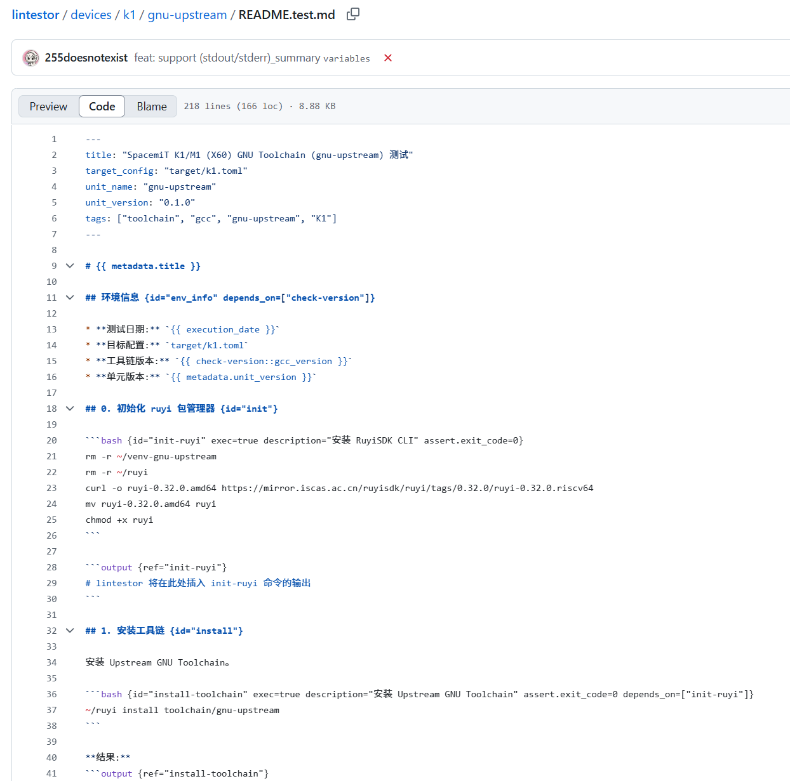
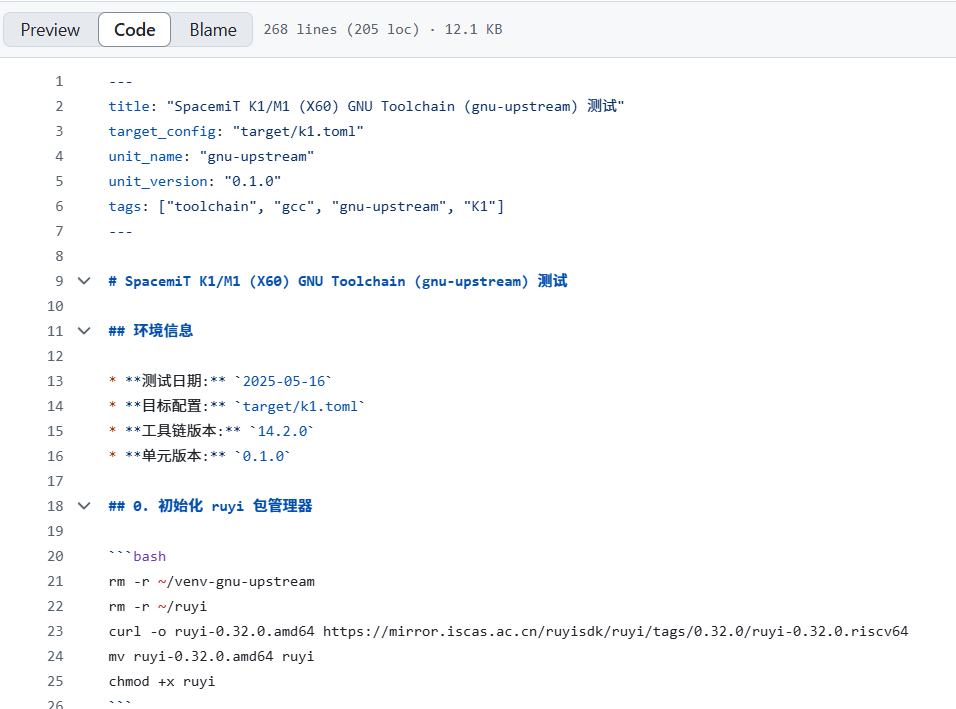
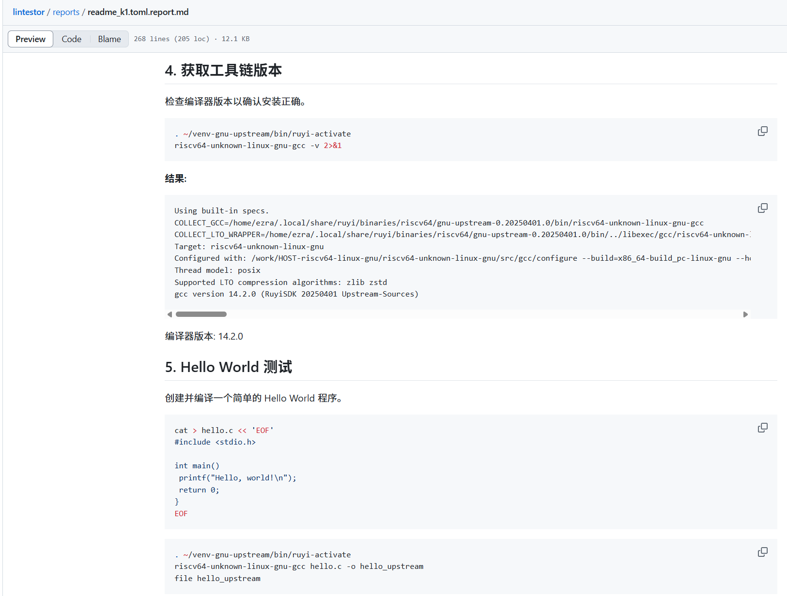
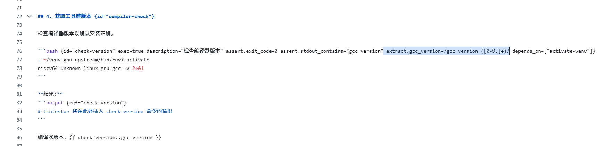
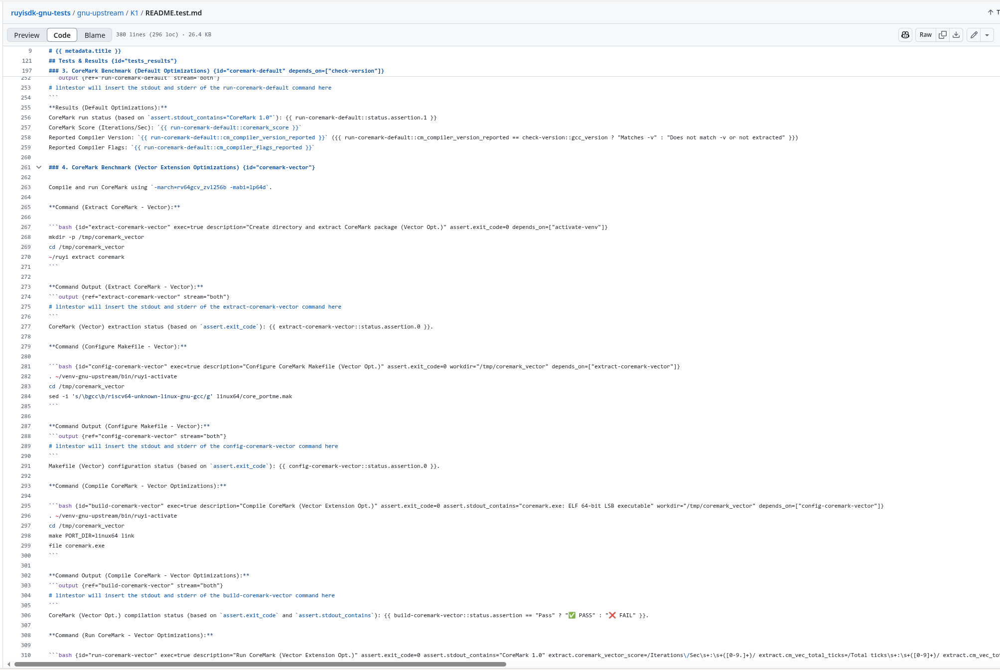

# week 1 (20250505 - 20250511)

- lintestor 重构、实现模板测试系统

(顺序：新 -> 旧)

- 支持基于模板直出报告和 summary.md 总结报告、有断言、变量、引用能力

  * [feat: Implement template reference system for test templates](https://github.com/255doesnotexist/lintestor/commit/79d9bb0)
  * [feat: enhance template parser to support multiple assertions and improve attribute extraction](https://github.com/255doesnotexist/lintestor/commit/5754828)

- lintstor 实现测试步骤断言能力

  * [feat: Enhance assertion types and parser functionality](https://github.com/255doesnotexist/lintestor/commit/9bc36d6)
  * [feat: enhance template parsing with detailed logging and error handling](https://github.com/255doesnotexist/lintestor/commit/47688b6)
  * [fix: update test reports with correct execution timestamps and enhance variable extraction patterns](https://github.com/255doesnotexist/lintestor/commit/01783c)

- lintestor 模板变量系统 PoC

  * [feat: update test reports with new execution timestamps and output formatting](https://github.com/255doesnotexist/lintestor/commit/2032daf)

- 测试用模板新增

  * [feat: add comprehensive test reports and enhance report aggregation logic](https://github.com/255doesnotexist/lintestor/commit/dd2e969)

- CLI 参数重构到 cli_args.rs 中

  * [feat(v0.2.0): Enhance CLI argument handling and add report aggregation features](https://github.com/255doesnotexist/lintestor/commit/7254553)

- 大量关于新模板机制的解析和适配代码

  * [refactor: bunch of new templates adapts](https://github.com/255doesnotexist/lintestor/commit/526d9fb)

- 重构测试脚本管理器，为管理测试模板准备

  * [Refactor test script management to use templates](https://github.com/255doesnotexist/lintestor/commit/e7fb624)

- 利用重写的 TestExecutor 封装统一了测试行为

  * [feat: Implement unified test execution logic with TestExecutor](https://github.com/255doesnotexist/lintestor/commit/551603c)

- 将 lintestor 原本的比较局限限定的 [发行版, 包] 对应测试概念改为 [测试目标, 测试单元] 概念，保持兼容性但应用范围更广

  * [refactor: distro -> target, package -> unit](https://github.com/255doesnotexist/lintestor/commit/9fe79d8)

# week 2 (20250512 - 20250519)

- lintestor 现已支持在 BPI-F3 (K1) 上的 ruyisdk-gnu-toolchain 的自动化测试，可以实现全自动直出报告（[测试模板](https://github.com/255doesnotexist/lintestor/blob/ruyisdk-gnu-tests/devices/k1/gnu-upstream/README.test.md) | [测试报告](https://github.com/255doesnotexist/lintestor/blob/ruyisdk-gnu-tests/reports/readme_k1.toml.report.md)）

## 从元数据、自动设置的测试时间变量中提取需要的标题等变量内容

这里的 GCC 版本（工具链版本）引用的是后文步骤中提取的，顺带展示了 lintestor 的测试步依赖解析能力。

## 通过正则表达式从测试输出中提取 GCC 版本

通过设置 extract.var_name=/regex/ attribute，可以从标注输出、标准错误中提取模板中需要用来填充的变量内容，完整变量名为 {{ template_id::step_id::var_name }}。其中 var_name 中可以包含 '.' 。

通过 depends_on=[依赖的步骤] 可以设定本测试步骤（代码块/标题块）必须在某一些步骤执行完成后再执行。

通过 assert.exit_code / assert.stdout/err_contains/not_contains 可以对测试步的输出结果进行断言检查，可以在后续 status.assertion 中调出。

除了一般的模板变量替换外，还支持三目表达式条件替换。 

如，对于 XXX 的测试{{ stepid::status.exit_code !=0 ? "失败" : "通过" }}了。

在代码块中也可以使用模板变量哦。因此你可以通过模板变量在代码块间传递数据。但是不允许有循环依赖。

二级标题下的所有代码块和三级标题执行完成后，二级标题才会执行。二级标题隐式依赖所有低于它等级的标题块和它们同级的代码块。而一级标题依赖二级标题和与二级标题同级的代码块。以此类推。

## 其他功能：

(顺序：新 -> 旧)

- lintestor 实现原生串口测试能力，不再依赖 boardtest（并允许超时时长配置以人类友好方式书写）

  * [feat: serial testing_type prototype, and timeout now support humanserde format (Ns...)](https://github.com/255doesnotexist/lintestor/commit/9550de5)

- 跨模板变量引用修复

  * [chore: fix reference template tests](https://github.com/255doesnotexist/lintestor/commit/6d3b155)

- 模板元数据现可以变量形式嵌入最终模板输出，理论兼容支持矩阵格式 metadata 以 {{ devicexx::metadata.vendor }} 形式调用 （模板 metedata 中需先声明 reference: "device/README.md" as: "devicexx"）

  * [feat: add metadata.custom_fields to the input](https://github.com/255doesnotexist/lintestor/commit/8bfddff)

- 现在模板支持引用标准输入输出的 summary 变量，而不是输出全文

  * [feat: support (stdout/stderr)_summary variables](https://github.com/255doesnotexist/lintestor/commit/7061221)
  * [Merge remote-tracking branch 'refs/remotes/origin/ruyisdk-gnu-tests' into ruyisdk-gnu-tests](https://github.com/255doesnotexist/lintestor/commit/cc1d868)

- 模板代码块在最终渲染后的报告中不再展示 attributes

  * [feat: remove attr strs in rendered CodeBlocks](https://github.com/255doesnotexist/lintestor/commit/c150916)

- 标题块因有独特隐式划分依赖层级作用，从文本块中单独提出自成一个内容块类型

  * [feat: split heading block from text block, and appends more infos](https://github.com/255doesnotexist/lintestor/commit/8af4e18)

- 自动机解析模板变量时如果变量名中有换行符则不认为是一个有效的变量标识符

  * [fix: ignore variable if the inner id got \n or \r exists](https://github.com/255doesnotexist/lintestor/commit/032c7f6)

- unit_version_cmd 改为静态的 unit_version
- metadata.target -> metadata.target_name
- metadata.unit -> metadata.unit_name 

  * [feat: metadata vars name change, replace unit_version in tests](https://github.com/255doesnotexist/lintestor/commit/c2524f6)
  * [feat: replace unit_version_command with static unit_version (indicates the test template unit version)](https://github.com/255doesnotexist/lintestor/commit/6611ce0)

- 自动机解析 attributes 时支持解析列表

  * [feat: allow ListValue when parsing attributes string in fsm](https://github.com/255doesnotexist/lintestor/commit/a04b728)

- 实现每个测试步的测试结果变量，execution 是基于 exit_code 的执行结果，assertion 是基于断言的总测试结果
- 可以通过 {{ step_id::status.assertion.0 }} 的方式单独查询第 N 个断言的结果

  * [feat: implement step status.execution/assertion variable](https://github.com/255doesnotexist/lintestor/commit/f3b5f1f)

- 引用当前模板变量时，允许忽略当前模板名

  * [feat: support auto completion for abbv first::second -> current_template_id::first::second](https://github.com/255doesnotexist/lintestor/commit/e84d87d)

- 使得父内容块隐式依赖子模板内容块

  * [feat: make parent blocks implicitly depends_on child blocks](https://github.com/255doesnotexist/lintestor/commit/2328cb8)

- 重写 attributes 解析器，使用手搓的自动机

  * [feat: propose a simple fsm for parsing attr strings, remove old 0.1.6 based intergration tests](https://github.com/255doesnotexist/lintestor/commit/13c02cd)

- 解析 attributes 时采用更鲁棒的正则表达式，但是正则表达式无法严格匹配提取正则表达式自己，后弃用这种解析方式

  * [fix: take more robust regex for attr matching, which fix assertion extracting](https://github.com/255doesnotexist/lintestor/commit/d79b93b)

- 确认测试步输出块可在 k1 上正常渲染测试结果

  * [chore: just to confirm output block are ok on k1 testing](https://github.com/255doesnotexist/lintestor/commit/73e65be)

- 在最终输出报告中清理一些块的 attributes

  * [fix: clean markdown markup robustly](https://github.com/255doesnotexist/lintestor/commit/54ea658)

- 修复一些变量唯一标识符不匹配的问题

  * [feat: enhance summary and result ID handling (fixes the issue that sometimes output block cannot found the result it refers to)](https://github.com/255doesnotexist/lintestor/commit/0f0e3e9)

- 重构与代码清理

  * [refactor: Clean up unused code and improve variable management in multiple modules](https://github.com/255doesnotexist/lintestor/commit/7c29c6b)

- 变量管理器支持处理命名空间（跨模板引用）

  * [feat: Enhance VariableManager with namespace handling and template ID registration](https://github.com/255doesnotexist/lintestor/commit/7523daa)
  * [refactor: Clean up code structure and improve variable management in template processing](https://github.com/255doesnotexist/lintestor/commit/b096fa1)

- 修改 metadata 中引用模板的写法

  * [fix: metadata reference/as not match with path/namespace](https://github.com/255doesnotexist/lintestor/commit/c646656)

- 实现基于测试步的测试批运行器，以及大量原有代码重构

  * [refactor: Implement Step-based batch executor, and bunch of other improvements](https://github.com/255doesnotexist/lintestor/commit/f69d7de)

# week 3 (20250519 - 20250526)

- ruyisdk-gnu-tests 分支更新与优化

  * [chore: add k1 plct tests for test](https://github.com/255doesnotexist/lintestor/commit/3787fcc)

  * [feat: remove newline in stdout/err summary](https://github.com/255doesnotexist/lintestor/commit/3d032e8)
  * [chore: update more complex k1 report](https://github.com/255doesnotexist/lintestor/commit/293e3f5)
  * [fix: output block re should match whole block](https://github.com/255doesnotexist/lintestor/commit/7896d9e)
  * [feat: when continue_on_error set, we get a pause](https://github.com/255doesnotexist/lintestor/commit/5d34d6c)

  * [feat: now extraction will try to extract variable from both (stdout/stderr)](https://github.com/255doesnotexist/lintestor/commit/f356632)
  * [feat: add connection pool to reduce remote connection overhead](https://github.com/255doesnotexist/lintestor/commit/d782bfb)
  * [feat: early tell user ghost deps](https://github.com/255doesnotexist/lintestor/commit/b95bdca)
  * [feat: make output support stream attr](https://github.com/255doesnotexist/lintestor/commit/44242f5)
  * [feat: output block re expansion](https://github.com/255doesnotexist/lintestor/commit/c66adb3)
  * [feat: add stream attr for OutputBlock, could be 'stdout' / 'stderr' / 'both'](https://github.com/255doesnotexist/lintestor/commit/3749f4f)
  * [feat: add metadata.target_description variable](https://github.com/255doesnotexist/lintestor/commit/428017f)
  * [feat: add name, description parsing at TargetConfig, and TemplateMetadata now got TargetConfig instead of PathBuf](https://github.com/255doesnotexist/lintestor/commit/ec7188e)
  * [feat: allow overwrite previous var value](https://github.com/255doesnotexist/lintestor/commit/81535a1)

- ruyisdk-gnu-tests/lintestor-templates 分支加了更 fancy 一点的模板

  * [feat: K1 initial version lintestor-templates](https://github.com/QA-Team-Io/ruyisdk-gnu-tests/commit/40beaf2)

