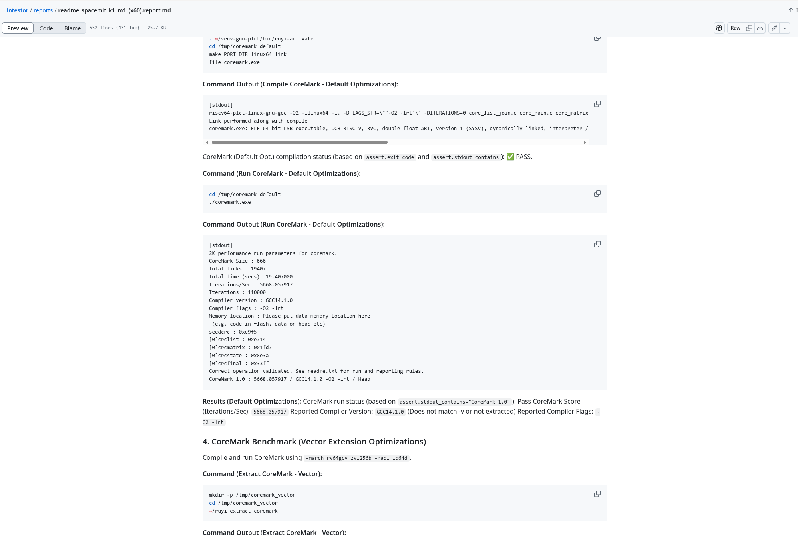
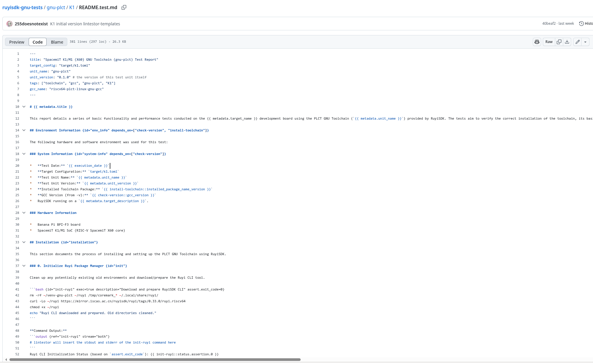
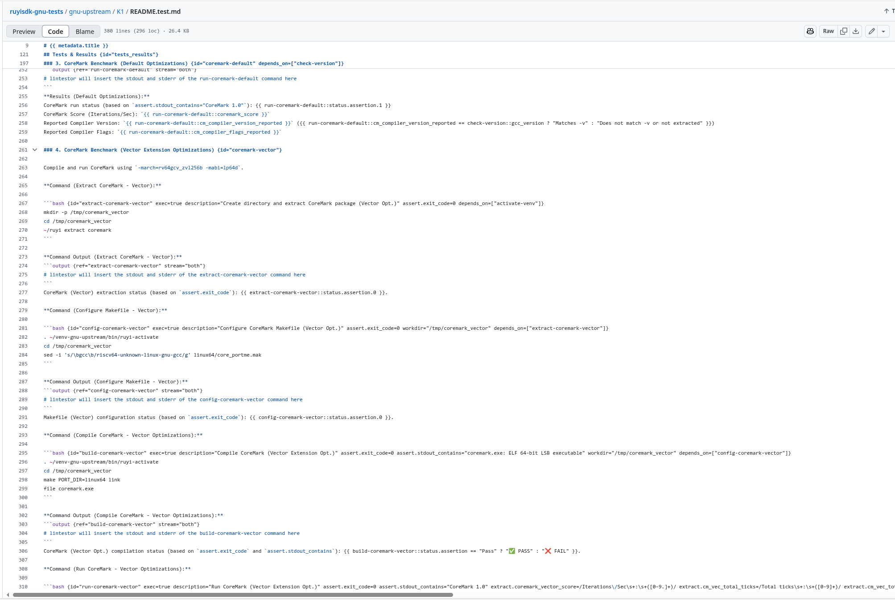

# week 3 (20250519 - 20250526)

- ruyisdk-gnu-tests 分支更新与优化

  * [chore: add k1 plct tests for test](https://github.com/255doesnotexist/lintestor/commit/3787fcc)

  * [feat: remove newline in stdout/err summary](https://github.com/255doesnotexist/lintestor/commit/3d032e8)
  * [chore: update more complex k1 report](https://github.com/255doesnotexist/lintestor/commit/293e3f5)
  * [fix: output block re should match whole block](https://github.com/255doesnotexist/lintestor/commit/7896d9e)
  * [feat: when continue_on_error set, we get a pause](https://github.com/255doesnotexist/lintestor/commit/5d34d6c)

  * [feat: now extraction will try to extract variable from both (stdout/stderr)](https://github.com/255doesnotexist/lintestor/commit/f356632)
  * [feat: add connection pool to reduce remote connection overhead](https://github.com/255doesnotexist/lintestor/commit/d782bfb)
  * [feat: early tell user ghost deps](https://github.com/255doesnotexist/lintestor/commit/b95bdca)
  * [feat: make output support stream attr](https://github.com/255doesnotexist/lintestor/commit/44242f5)
  * [feat: output block re expansion](https://github.com/255doesnotexist/lintestor/commit/c66adb3)
  * [feat: add stream attr for OutputBlock, could be 'stdout' / 'stderr' / 'both'](https://github.com/255doesnotexist/lintestor/commit/3749f4f)
  * [feat: add metadata.target_description variable](https://github.com/255doesnotexist/lintestor/commit/428017f)
  * [feat: add name, description parsing at TargetConfig, and TemplateMetadata now got TargetConfig instead of PathBuf](https://github.com/255doesnotexist/lintestor/commit/ec7188e)
  * [feat: allow overwrite previous var value](https://github.com/255doesnotexist/lintestor/commit/81535a1)

- ruyisdk-gnu-tests/lintestor-templates 分支加了更 fancy 一点的模板

  * [feat: K1 initial version lintestor-templates](https://github.com/QA-Team-Io/ruyisdk-gnu-tests/commit/40beaf2)

