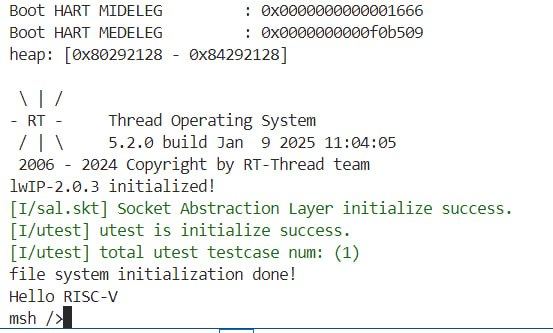
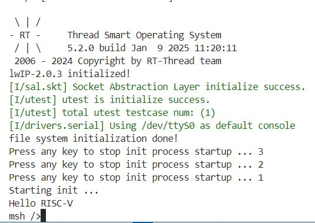
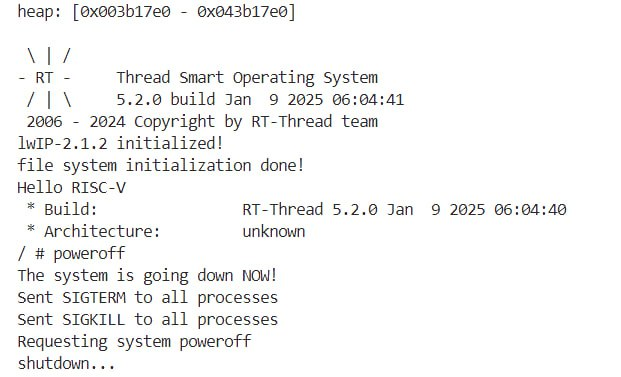

# week 0 (20250106 - 20250112)

考试结束后对 rtthread standard 和 smart 利用 qemu 进行了测试。

主要按照 [测试文档](https://github.com/plctlab/plct-rt-thread/blob/notes/0.notes/20241223-rtt-test-guide.md) 完成测试文档中的 case 5 和 case 6。

本任务后续被取消，因此未形成公开的测试报告。简要的测试结果如下。

qemu 环境下 rtt standard, smart, smart (附加 userapp rootfs) 都能启动，进入 ash 后可以通过 poweroff 关机。

case 5 (bsp/qemu-virt64-riscv):

测试 QEMU 运行 RT standard:
[x] 配置为 RT standard 模式下（默认），编译正常, 生成 rtthread.bin。
[x] 运行 run.sh 后控制台（qemu）显示 RT-Thread 标准版 logo 并进入 msh，运行正常。

case 6 (bsp/qemu-virt64-riscv):

测试 QEMU 运行 RT smart:
[x] 配置为 RT smart 模式下并使能 lwext4，编译正常, 生成 rtthread.bin。
[x] 运行 run.sh <path_to_ext4_image> 后控制台（qemu）显示 RT-Thread Smart logo 并可以挂载 ext4 文件进入 ash (ok)，运行正常。
[x] 执行 poweroff 可以退出 qemu。

挂载 prebuilt ext4 rootfs 能进入 ash，能通过 ash 关机。