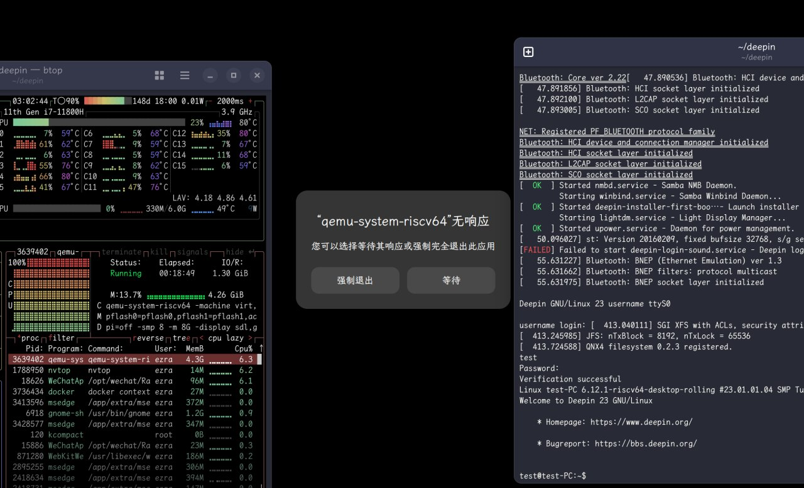

# week 2 (20250120 - 20250126)

本周主要完成了 openEuler 24.03 SP1 riscv64 (mainline) on QEMU 的[测试报告](https://github.com/QA-Team-lo/oscompare/blob/main/openEuler/QEMU/README.md)、和 deepin 23 beige preview (RISC-V 64) 的[测试报告](https://github.com/QA-Team-lo/oscompare/blob/main/Deepin/QEMU/README.md)。（截止周报撰写时并非公开可见链接。）

对于 openEuler 24.03 SP1 的版本选取原因：主线版本 24.09 并未为桌面环境体验打包足够的包。因此回退到上一个 LTS 版本进行测试，希望结果能展现 openEuler 的实际桌面体验。

deepin 23 beige preview (RISC-V 64) 选取版本是测试时为 QEMU 打包的最新的 deepin-ports CI 版本 20250109。

在遵循 [文档](https://deepin-community.github.io/sig-deepin-ports/docs/install/riscv/generic) 安装测试时，可能由于本机 RISCV_VIRT_CODE.fd 固件版本和文档撰写者的固件、QEMU 版本有出入，virtio-vga-gl 设备无法显示画面。而后基于 openEuler 的启动脚本重新修改编写配置并通入 virtio-gpu-gl 设备后得以成功启动。修改后的完整启动脚本可见于测试报告中。

随后对 livecd-installer 进行了多次启动安装验证。如选择 Install Deepin 25 进入安装界面后选择全盘安装会导致数据分区大小计算错误（-29XMiB）无法正常安装释放 roofs、efi。仅有高级安装选项能正常工作。

在高级安装选项自主指定 efi 分区、根分区、交换分区以及挂载关系后，efi 分区中并未释放任何文件，导致重启后无法启动。需要手动在宿主机挂载磁盘镜像补全 efi 分区引导文件、grub 配置（过程在测试报告中有详细记载）。

而后可以正常引导、oobe、进入 dde 登录界面。但输入账户密码后 QEMU 假死无法正常进入桌面。如不选择 Install Deepin 25，使用 Try Deepin 进入 LiveCD 环境，则可正常进入 oobe 环境完成配置，依旧无法进入 dde 桌面。 

