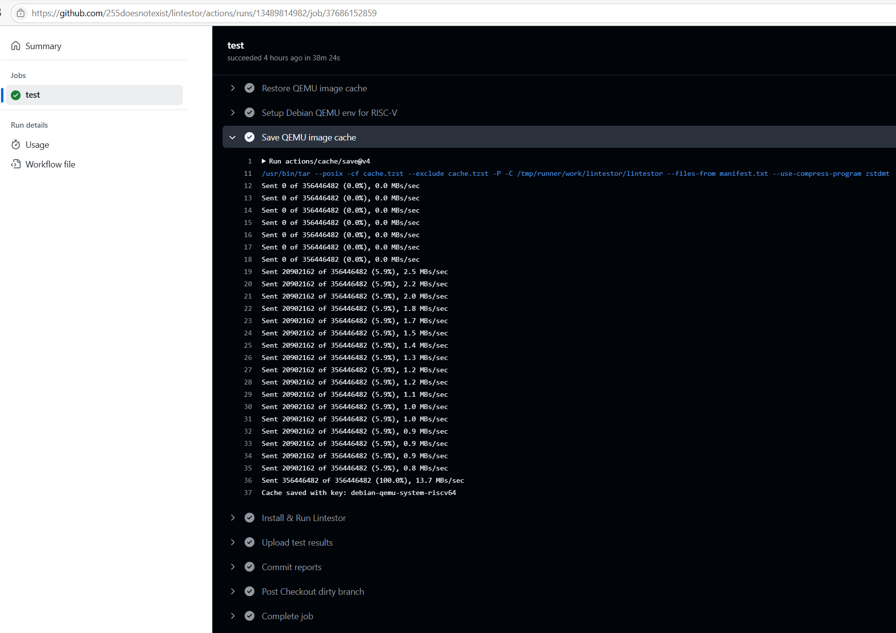
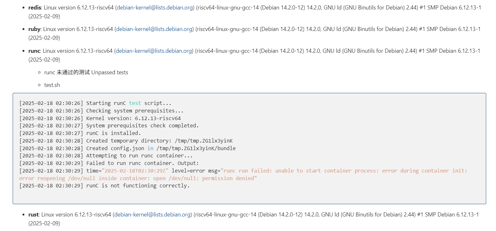

# week 2 (20250217 - 20250223)

1. 在 Lintestor Weekly Debian CI Test 中试验性为测试用系统镜像启用缓存 ([1](https://github.com/255doesnotexist/lintestor/commit/cab3f39d4b9dc3fae9cd978b40744a6b75520d4e), [2](https://github.com/255doesnotexist/lintestor/commit/d0df47a8cc1f03ba4a749741162e08a1a5d54ccb))，避免每次从远端拉取系统磁盘镜像。后续如未发现明显问题也将应用到其他 qemu 类 ci 测试中。

2. 为 openjdk 测试[关闭 sv57](https://github.com/255doesnotexist/lintestor/commit/b1963886258af58e2a1093ba3a98bfd9a4cd712f)。因为“only satp modes up to sv48 are supported for openjdk now”。

3. 现在最终生成的 Markdown 报告产物会附带详细的测试名和测试输出（如果该组测试中的某一项测试未通过）。 ([3](https://github.com/255doesnotexist/lintestor/commit/9d57b4bd45a266e1948752dd5c38046c245ac5d8))

4. [弃用 actions/artifacts@v3 转向 actions/artifacts@v4。](https://github.com/255doesnotexist/lintestor/commit/673096c32b176780a0abe5c241910c8c825254cb)因 v3 版本 action 已在本月月初被 GitHub 弃用。